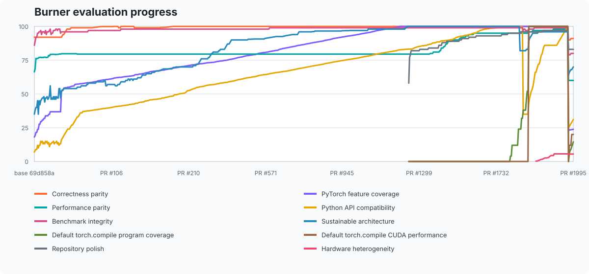

# pytorch-rs

`pytorch-rs` is a native Rust tensor and deep-learning engine exposed through a PyTorch-compatible Python API. It pursues PyTorch semantics, broad feature coverage, and competitive performance. It is an early experimental implementation, not yet a PyTorch replacement.

The project is improved through [Burner](https://github.com/bobrenjc93/burner): each increment is developed in an isolated branch, independently reviewed, and measured against the same base revision before it can merge.

## Current baseline

Python package names may contain a hyphen, but Python identifiers may not. The package is therefore installed as `torch-rs` and imported as `torch_rs`, conventionally aliased to `torch` for drop-in-style code:

```python
import mmap
from collections import OrderedDict
from types import SimpleNamespace

import torch_rs as torch

x = torch.tensor([[-1.0, 2.0], [3.0, -4.0]])
y = torch.ones([2, 2])
result = torch.relu(x + y)
assert result.tolist() == [[0.0, 3.0], [4.0, 0.0]]
product = torch.matmul(input=x, other=y)
assert product.tolist() == [[1.0, 1.0], [-1.0, -1.0]]
assert torch.set_float32_matmul_precision("highest") is None
assert torch.get_float32_matmul_precision() == "highest"
assert torch.set_deterministic_debug_mode("default") is None
assert torch.get_deterministic_debug_mode() == 0
assert torch.are_deterministic_algorithms_enabled() is False
assert torch.is_deterministic_algorithms_warn_only_enabled() is False
scaled = torch.multiply(input=2.0, other=x)
assert scaled.tolist() == [[-2.0, 4.0], [6.0, -8.0]]
exponential = torch.exp(input=x)
assert exponential.shape == x.shape
hyperbolic = torch.tanh(input=x)
assert hyperbolic.shape == x.shape
functional_hyperbolic = torch.nn.functional.tanh(x)
assert functional_hyperbolic.tolist() == hyperbolic.tolist()
logistic = x.sigmoid()
functional_logistic = torch.nn.functional.sigmoid(x)
assert functional_logistic.tolist() == logistic.tolist()
functional_result = torch.nn.functional.relu(x + y)
assert functional_result.tolist() == result.tolist()
squared_error = torch.nn.functional.mse_loss(x, y, reduction="none")
assert squared_error.tolist() == [[4.0, 1.0], [4.0, 25.0]]
assert torch.nn.functional.dropout(x, training=False) is x
assert torch.nn.functional.dropout(x, p=0, training=True, inplace=True) is x
fully_dropped = torch.nn.functional.dropout(x, p=1, training=True)
assert fully_dropped.tolist() == [[-0.0, 0.0], [0.0, -0.0]]
assert not fully_dropped.is_set_to(x)
signals = torch.zeros((1, 2, 3))
assert torch.nn.functional.dropout1d(signals, p=0, training=True) is signals
feature_maps = torch.zeros((1, 2, 3, 4))
assert torch.nn.functional.dropout2d(feature_maps, training=False) is feature_maps
volumes = torch.zeros((1, 2, 3, 4, 5))
assert torch.nn.functional.dropout3d(volumes, p=0, training=True) is volumes
assert torch.is_signed(input=x)
assert torch.get_device(input=x) == -1
assert torch.cpu.is_available() is True
assert torch.cpu.current_device() == "cpu"
assert torch.cpu.device_count() == 1
assert torch.cpu.synchronize() is None
event = torch.cpu.Event()
assert event.query() is True
assert event.record() is None
assert event.wait() is None
assert event.synchronize() is None
assert torch.accelerator.current_accelerator() is None
assert torch.accelerator.is_available() is False
assert torch.accelerator.device_count() == 0
assert torch.accelerator.empty_cache() is None
assert torch.accelerator.reset_peak_memory_stats() is None
assert torch.accelerator.memory_allocated() == 0
assert torch.accelerator.memory_stats() == OrderedDict()
try:
    torch.accelerator.current_device_index()
except RuntimeError as error:
    assert str(error) == "Cannot access accelerator device when none is available."
else:
    raise AssertionError("current_device_index() unexpectedly returned")
assert torch.get_num_threads() == 1
assert torch.get_num_interop_threads() == 1
assert torch.has_openmp is False
assert torch.has_mkl is False
assert torch.has_lapack is False
assert torch.has_spectral is False
assert torch.backends.openmp.is_available() is False
assert torch.backends.mkl.is_available() is False
assert torch.backends.nnpack.is_available() is False
assert torch.backends.cuda.is_built() is False
assert torch.backends.cudnn.is_available() is False
assert torch.backends.cudnn.version() is None
assert torch.backends.mha.get_fastpath_enabled() is True
assert torch.backends.mha.set_fastpath_enabled(False) is None
assert torch.backends.mha.get_fastpath_enabled() is False
torch.backends.mha.set_fastpath_enabled(True)
assert torch.version.__version__ == torch.__version__
assert torch.version.debug is False
assert torch.version.cuda is None
assert torch.version.hip is None
assert torch.version.rocm is None
assert torch.version.xpu is None
assert torch.autograd.is_multithreading_enabled() is True
assert torch.compiler.is_compiling() is False
assert torch.compiler.is_dynamo_compiling() is False
assert torch.compiler.is_exporting() is False
portable_guard_entries = (
    SimpleNamespace(guard_type="GLOBAL_STATE"),
    SimpleNamespace(guard_type="SHAPE_ENV"),
    SimpleNamespace(guard_type="TENSOR_MATCH", is_global=False),
)
assert torch.compiler.keep_portable_guards_unsafe(
    iter(portable_guard_entries)
) == [True, True, True]
assert torch.compiler.skip_all_guards_unsafe(iter((object(), object()))) == [
    False,
    False,
]
guard_entries = (
    SimpleNamespace(is_global=True),
    SimpleNamespace(is_global=False),
)
assert torch.compiler.skip_guard_on_globals_unsafe(iter(guard_entries)) == [
    False,
    True,
]
assert torch.jit.isinstance([1, 2], list[int]) is True
assert torch.jit.isinstance(None, int | None) is True
assert torch.jit.onednn_fusion_enabled() is False

@torch.compiler.assume_constant_result
def constant_answer():
    return 42

assert constant_answer._dynamo_marked_constant is True
assert constant_answer() == 42

@torch.compiler.disable
def eager_only(value):
    return value + 1

assert eager_only._torchdynamo_disable is True
assert eager_only(41) == 42
assert torch.serialization.LoadEndianness.NATIVE.value == 1
assert torch.serialization.get_default_load_endianness() is None
torch.serialization.set_default_load_endianness(
    torch.serialization.LoadEndianness.LITTLE
)
assert (
    torch.serialization.get_default_load_endianness()
    is torch.serialization.LoadEndianness.LITTLE
)
torch.serialization.set_default_load_endianness(None)
assert torch.serialization.get_crc32_options() is True
assert torch.serialization.get_default_mmap_options() == getattr(
    mmap, "MAP_PRIVATE", None
)
assert torch.distributed.is_available() is False
assert torch.distributed.get_pg_count() == 0
try:
    torch.distributed.get_rank()
except ValueError as error:
    assert "Default process group has not been initialized" in str(error)
try:
    torch.distributed.get_world_size()
except ValueError as error:
    assert "Default process group has not been initialized" in str(error)
assert torch.distributed.is_gloo_available() is False
assert torch.distributed.is_initialized() is False
assert torch.distributed.is_mpi_available() is False
assert torch.distributed.is_nccl_available() is False
assert torch.distributed.is_ucc_available() is False
assert torch.distributed.is_xccl_available() is False
assert torch.float32.abbr == "f32"
assert torch.float32.to_real() is torch.float32
limits = torch.finfo()
assert limits == torch.finfo(torch.float)
assert limits.dtype == "float32" and limits.bits == 32
assert torch.can_cast(from_=torch.float, to=torch.float32) is True
assert torch.promote_types(type1=torch.float, type2=torch.float32) is torch.float32
assert torch.broadcast_shapes((2,), [3, 1]) == torch.Size([3, 2])
assert x.dense_dim() == x.ndim
assert x.sparse_dim() == 0
assert x.is_pinned() is False
assert x.is_shared() is False
assert x.output_nr == 0
assert x.grad_dtype is torch.float32
scalar = torch.tensor(-0.0, requires_grad=True)
assert f"{scalar:+08.2f}" == "-0000.00"

# Transposes are native shared-storage views. Tensor.T reverses every dimension,
# real-valued Tensor.H transposes matrices, Tensor.mT and real-valued Tensor.mH
# swap the final matrix dimensions, Tensor.swapdims()/torch.swapdims() and
# Tensor.swapaxes()/torch.swapaxes() swap any two, while Tensor.t()/torch.t()
# accept rank <= 2.
assert x.T.shape == (2, 2)
assert x.H.shape == (2, 2)
assert x.t().shape == (2, 2)
assert torch.t(input=x).shape == (2, 2)
batched_matrices = torch.zeros((4, 2, 3))
assert batched_matrices.mT.shape == (4, 3, 2)
assert batched_matrices.mH.shape == (4, 3, 2)
assert torch.adjoint(input=batched_matrices).shape == (4, 3, 2)
assert torch.swapdims(input=batched_matrices, dim0=0, dim1=-1).shape == (3, 2, 4)
assert torch.swapaxes(input=batched_matrices, axis0=0, axis1=-1).shape == (3, 2, 4)
assert batched_matrices.permute(-1, 0, 1).shape == (3, 4, 2)
assert torch.permute(input=batched_matrices, dims=[-1, 0, 1]).shape == (3, 4, 2)
assert batched_matrices.movedim(0, -1).shape == (2, 3, 4)
assert batched_matrices.moveaxis(0, -1).shape == (2, 3, 4)
assert torch.movedim(batched_matrices, source=0, destination=-1).shape == (2, 3, 4)
assert torch.moveaxis(batched_matrices, source=0, destination=-1).shape == (2, 3, 4)
matrix_view = batched_matrices.select(dim=-3, index=1)
assert matrix_view.shape == (2, 3)
assert torch.select(batched_matrices, dim=-3, index=1).is_set_to(matrix_view)

# PyTorch-compatible view calls use the same conventional alias.
batched = torch.zeros((1, 2, 1, 3))
matrix = torch.squeeze(batched, dim=(0, 2))
assert matrix.shape == (2, 3)

# Flatten compatible ranges as views and materialize non-contiguous ranges.
features = torch.flatten(matrix, start_dim=0, end_dim=1)
assert features.shape == (6,)

# Materialize a view in native row-major or channel-last storage.
view = torch.transpose(torch.zeros((2, 3, 4, 5)), 0, 3)
packed = view.contiguous()
nhwc_storage = packed.contiguous(memory_format=torch.channels_last)
assert packed.is_contiguous()
assert nhwc_storage.is_contiguous(memory_format=torch.channels_last)

# Default and preserve-format CPU calls retain the exact existing CPU object;
# an explicit different layout can materialize new storage.
assert view.cpu() is view
cpu_nhwc = view.cpu(memory_format=torch.channels_last)
assert cpu_nhwc.is_contiguous(memory_format=torch.channels_last)
```

The CPU core provides `float32` tensors, checked construction including copied one-dimensional numeric PEP 3118 buffers, constant-filled creation, layout queries, `Tensor.dense_dim()` and `Tensor.sparse_dim()` strided-layout dimension metadata, no-argument `Tensor.is_pinned()` metadata for the exclusively pageable CPU storage model, no-argument `Tensor.is_distributed()` metadata for supported local tensors, leaf-only `Tensor.retain_grad()` as a no-op for tensors with `requires_grad=True`, and read-only `Tensor.retains_grad` metadata that remains `False` because retained non-leaf gradients are unsupported, dimension-zero `Tensor.select()`/`torch.select()` single first-axis views and `Tensor.unbind()`/`torch.unbind()` first-axis views, read-only `Tensor.output_nr` metadata (`0` for single-output operations, with PyTorch-compatible multi-output indices for grad-tracked `Tensor.unbind()`, `torch.unbind()`, and tensor iteration; `Tensor.chunk` and `torch.chunk` are not exposed), read-only `Tensor.is_sparse` and `Tensor.is_sparse_csr` strided-layout introspection, read-only `Tensor.is_cpu` and `Tensor.is_cuda` device introspection, PyTorch-compatible `Tensor.cpu()` identity and memory-format conversion for the supported CPU device, read-only `Tensor.is_quantized` dtype introspection, dtype-backed `Tensor.is_signed()` and `torch.is_signed()` queries, read-only `torch.float32.abbr == "f32"` metadata, canonical `torch.float32.to_real()` identity, float32-only `torch.finfo` metadata, stride-aware indexing, `Tensor.view()`/`Tensor.view_as()` shared-storage views, arbitrary metadata-only `Tensor.permute()` and `torch.permute()` views, integer-axis `Tensor.movedim()`/`Tensor.moveaxis()`, `torch.movedim()`, and top-level `torch.moveaxis()` views, metadata-only transpose, `Tensor.swapdims()`/`torch.swapdims()` and `Tensor.swapaxes()`/`torch.swapaxes()`, and squeeze views, compatible `Tensor.reshape()` and `Tensor.reshape_as()` view-or-copy transforms, PyTorch-compatible read-only `Tensor.T`, `Tensor.mT`, and real-valued `Tensor.H`/`Tensor.mH` views, `Tensor.adjoint()`/`torch.adjoint()` matrix-adjoint views, rank-limited `Tensor.t()` and `torch.t()`, `Tensor.flatten()`, `Tensor.ravel()`, and `torch.flatten()`, native `Tensor.contiguous()` materialization for row-major, channels-last, and channels-last-3d storage, `Tensor.type()` introspection and identity-only supported-type conversions, no-op identity `Tensor.type_as()` conversion, and read-only `Tensor.real` identity for the supported type, independent deep cloning, exact `Tensor.equal()` and `torch.equal()` comparison, identity `Tensor.positive()`/`torch.positive()` and unary `+`, unary `-`, `Tensor.neg()`, its `Tensor.negative()` alias, `torch.neg()`, and the distinct top-level `torch.negative()` builtin, broadcast tensor and real-scalar addition, subtraction, multiplication through `*`, `Tensor.mul()`, `Tensor.multiply()`, `torch.mul()`, and the distinct top-level `torch.multiply()` builtin, and true division, `Tensor.relu()`, `torch.relu()`, out-of-place `torch.nn.functional.relu(input, inplace=False)`, `Tensor.tanh()`, `torch.tanh()`, direct `torch.nn.functional.tanh(input)` delegation, and inference-only `torch.nn.functional.mse_loss(input, target, reduction="none")` for exact same-shaped tensors or one rank-0 operand broadcast across the other, deterministic `torch.nn.functional.dropout(input, p=1, training=True, inplace=False)` plus its identity cases, rank-2 out-of-place and rank-3 identity-only `torch.nn.functional.dropout1d(input, p, training, inplace)`, rank-2/rank-3/rank-4 identity-only `torch.nn.functional.dropout2d(input, p, training, inplace)`, and rank-5 identity-only `torch.nn.functional.dropout3d(input, p, training, inplace)`, plus sum and rank-2 matrix multiplication through `@`, `Tensor.matmul()`, and `torch.matmul()`. Top-level `torch.neg()` and `torch.negative()` share the same layout-preserving float32 CPU negation and autograd path while remaining distinct builtins; their concrete `out` forms and the in-place `neg_`/`negative_` variants remain unsupported. Top-level `torch.mul()` and `torch.multiply()` accept tensor/tensor or tensor/real-scalar operands in either order and reuse the same broadcast and autograd kernels; their `out` forms and scalar-only multiplication remain unsupported. The functional ReLU delegates to the same native kernel; `inplace=True` is rejected before the input can be mutated. Functional tanh calls `input.tanh()` directly, preserving receiver overrides and the native method's values, layout, storage, mode dispatch, and autograd boundary. Functional dropout, rank-3 dropout1d, rank-2/rank-3/rank-4 dropout2d, and rank-5 dropout3d return the exact input object, including its storage, layout, and autograd history, when `training=False`, `p=0`, or the input is empty. Out-of-place rank-2 dropout1d accepts those same deterministic cases and follows PyTorch's unbatched unsqueeze-and-squeeze path, returning a distinct view with shared storage, unchanged layout, and the corresponding autograd history. For nonempty standard dropout, out-of-place `training=True, p=1` delegates to native scalar multiplication by positive zero, producing independent layout-preserving storage with signed-zero and autograd behavior matching PyTorch. Probabilities strictly between zero and one, nonidentity inplace calls, rank-2 dropout1d inplace calls, and all nonidentity dropout1d, dropout2d, and dropout3d calls remain explicitly unsupported; dropout1d rejects inputs outside ranks 2 and 3, while dropout2d accepts ranks 2, 3, and 4 and dropout3d accepts rank 5. Rank-2 dropout2d calls emit PyTorch 2.13's deprecated-rank warning, while rank-3 calls emit its legacy compatibility warning. No RNG state or top-level dropout API is added. `Tensor.type()` returns the exact string `"torch.FloatTensor"` when its dtype is omitted or explicitly `None`; `torch.float32`, its `torch.float` alias, and `"torch.FloatTensor"` return the exact tensor wrapper through positional or `dtype=` forms, with strict-bool `non_blocking` accepted as an identity-only hint. These paths do not touch storage, layout metadata, or autograd state. Other targets and the deprecated `async` form are rejected before mutation. `torch.dtype.abbr` returns the native compact abbreviation for every supported `float32` descriptor. `dtype.to_real()` returns the exact canonical singleton for every supported `float32` descriptor; alternate dtype singletons, `dtype.to_complex()`, and complex-to-real mappings remain unsupported. `torch.finfo()`, `torch.finfo(torch.float32)`, `torch.finfo(torch.float)`, and the corresponding `type=` forms create fresh immutable objects whose limits come from the native dtype metadata; Python's `float` shorthand and all non-float32 dtypes remain unsupported. `Tensor.select(dim, index)` and `torch.select(input, dim, index)` normalize the negative first dimension and delegate values, strides, offsets, aliasing, empty views, and autograd to the native leading integer-index engine; other dimensions remain unsupported. `Tensor.view(shape)` accepts one positional integer or `__index__` value, one tuple, list, or `torch.Size` (including the sequence `size=` form), or exactly two, three, four, or five positional integer-compatible dimensions, and delegates shape inference, strides, offsets, aliasing, empty tensors, compatible noncontiguous layouts, errors, and autograd to the native view engine. Its dtype overload accepts positional or `dtype=` `torch.float32`/`torch.float` and returns a fresh detached wrapper with identical metadata and shared storage; integer `size=` keywords, six-or-more positional dimensions, mixed shape/dtype calls, and cross-dtype reinterpretation remain unsupported. `Tensor.permute()` accepts variadic dimensions, a tuple or list, and the `dims=` form; top-level `torch.permute(input, dims)` accepts a tuple or list. Both normalize negative axes and delegate all shape, stride, offset, storage, and autograd behavior to the native permutation engine. `Tensor.movedim(source, destination)`, `Tensor.moveaxis(source, destination)`, `torch.movedim(input, source, destination)`, and `torch.moveaxis(input, source, destination)` reuse that engine for integer axes, including negative dimensions, scalars, empty tensors, offset views, and noncontiguous views; sequence dimensions remain unsupported. `Tensor.T` reverses the complete shape and stride tables; because the supported dtype is real, `Tensor.H` uses that same transpose path for matrices while `Tensor.mT`, `Tensor.mH`, `Tensor.adjoint()`, and `torch.adjoint()` swap the final two dimensions for matrices or batches. Both swap aliases use the transpose engine for arbitrary dimension pairs, while `Tensor.t()` and `torch.t()` are unwarned alias views for scalars, vectors, and matrices and reject higher ranks. All of these permutation and transpose-family calls retain shared storage, offsets, dtype, and device. `Tensor.reshape_as(other)` passes `other.shape` through the same reshape engine, so storage sharing, materialization, strides, and autograd behavior match `Tensor.reshape(other.shape)`. Flatten preserves shared storage for stride-compatible ranges and eagerly creates an independent contiguous copy otherwise; ravel always returns a new one-dimensional Tensor wrapper, aliasing row-contiguous storage and materializing other layouts. Already-matching contiguous, `cpu()`, `type_as()`, `real`, `Tensor.positive()`, `torch.positive()`, and unary `+` calls preserve Python object identity and shared storage; CPU channel-last requests that need a different layout use the same checked materialization and autograd path as `contiguous()`. `Tensor.squeeze()`, `Tensor.squeeze(dim)`, and `torch.squeeze(input, dim)` retain shared storage, strides, and offsets just like PyTorch. This intentionally small surface gives the campaign an honest starting point. The compatibility contract is the observable Python API; the Rust library is its implementation engine.

`Tensor.__format__(format_spec)` matches Python/PyTorch scalar formatting for exact rank-0 CPU float32 tensors by formatting a detached Python scalar, so ordinary values, signed zero, infinities, and NaNs remain usable under active autograd without scalar-conversion warnings. Non-scalars use their normal string form for an empty specification and raise PyTorch's `TypeError` for nonempty specifications without changing storage or graph state. The Python-owned callable preserves `TorchFunctionMode` and unary override dispatch, metadata, direct-call errors, pickling, and module-reload behavior.

`Tensor.grad_dtype` is a read-only leaf-tensor query that returns the canonical `torch.float32` singleton used by native gradient accumulation. Non-leaf access raises PyTorch's error; setting `None` or an alternate gradient dtype remains unsupported.

`torch.overrides.has_torch_function_unary` is the public alias of the native `torch._C._has_torch_function_unary` builtin used by the Python-owned unary dispatch wrappers. It matches PyTorch's exact-tensor, Tensor-class, custom-override, disabled-handler, mode, and descriptor-failure behavior without exposing the generic or variadic probes.

`Tensor.ravel()` and top-level `torch.ravel()` share the native view-or-copy path: row-contiguous inputs alias storage through a new one-dimensional wrapper, while other layouts are materialized.

`Tensor.exp()` and `torch.exp()` share the native float32 CPU kernel and record `ExpBackward0` when eager gradient recording is active. Top-level calls accept `out=None`; concrete output tensors remain explicitly unsupported.

`Tensor.floor()`/`torch.floor(input, *, out=None)`, `Tensor.ceil()`/`torch.ceil(input, *, out=None)`, and `Tensor.trunc()`/`torch.trunc(input, *, out=None)` share the native unary-layout path for CPU float32 tensors, preserving PyTorch-compatible values, output strides, and fresh storage. `Tensor.fix()` and top-level `torch.fix(input, *, out=None)` are distinct method and function callables backed by that same truncation kernel, with PyTorch 2.13-compatible metadata and dispatch. Tracked `ceil`, `floor`, `trunc`, and `fix` calls record reusable `CeilBackward0`, `FloorBackward0`, and `TruncBackward0` nodes whose zero VJPs retain only graph and shape metadata, including for empty tensors and views; detached tensors and calls under `torch.no_grad()` remain on the inference path. The supported top-level calls accept `out=None`; concrete output tensors, higher-order differentiation, and the in-place `floor_`, `ceil_`, `trunc_`, and `fix_` variants remain unsupported.

`Tensor.sigmoid()` uses the unary-layout and `TorchFunctionMode` paths for CPU float32 tensors, including empty, offset, noncontiguous, and channel-last inputs. `torch.nn.functional.sigmoid(input)` delegates directly to `input.sigmoid()`, preserving receiver overrides, layout, fresh-storage behavior, mode dispatch, and the method's autograd boundary. Finite constructor-owned CPU float32 leaves of every supported rank, including rank-6, high-rank singleton shapes, and empty dimensions, plus finite owned rank-0 through rank-3 non-leaves produced by supported autograd operations, support first-order eager autograd through a saved-output `SigmoidBackward0` node. Tracked views, rank-4-or-higher non-leaves, and non-finite tracked inputs remain explicitly unsupported. Detached tensors and calls under `torch.no_grad()` retain the broader inference path. Top-level `torch.sigmoid`, higher-order gradients, `nn.Sigmoid`, and in-place sigmoid remain unsupported.

`Tensor.tanh()`, `torch.tanh()`, and `torch.nn.functional.tanh(input)` share the native layout-preserving float32 CPU kernel. The functional form delegates directly to `input.tanh()`, so receiver overrides and `TensorBase.tanh` mode dispatch are preserved. Finite constructor-owned rank-0 through rank-3 CPU float32 leaves, including singleton and empty dimensions, support first-order eager autograd through a saved-output `TanhBackward0` node; tracked views, non-leaf inputs, rank-4-or-higher tensors, and non-finite tracked inputs remain explicitly unsupported. Detached tensors and calls under `torch.no_grad()` retain the broader inference path. Top-level calls accept PyTorch's legacy input aliases and `out=None`; concrete output tensors, higher-order gradients, `nn.Tanh`, and in-place tanh remain explicitly unsupported.

`torch.nn.functional.mse_loss(input, target, size_average=None, reduce=None, reduction="none", weight=None)` accepts exact native CPU float32 tensors that are either same-shaped or have exactly one rank-0 operand, and fuses subtraction and square into one native binary pass. Scalar broadcasting emits PyTorch 2.13's size-mismatch warning. Scalar, empty, offset, row-major, noncontiguous, and channel-last operands produce PyTorch-compatible bitwise values, shapes, strides, and fresh independent storage without mutating either operand. Other broadcasting, `"mean"` and `"sum"` reductions, weights, legacy reduction arguments, Tensor subclasses, active `TorchFunctionMode` contexts, and active autograd recording remain explicitly unsupported; gradient-requiring operands work under `torch.no_grad()`.

`torch.can_cast` and `torch.promote_types` accept the existing `torch.float32`/`torch.float` singleton aliases in positional or canonical keyword forms. Casting between the supported aliases returns `True`, while promotion returns the same canonical singleton. No additional dtype, casting pair, or promotion pair is exposed.

`torch.functional.broadcast_shapes` and its identical top-level `torch.broadcast_shapes` alias compute canonical `torch.Size` results directly from nonnegative Python integer, tuple, list, and `torch.Size` inputs without creating tensors. `torch.functional.broadcast_tensors(*tensors)` and its canonical top-level alias accept zero inputs or exact native tensors with identical shapes and return a tuple containing those exact objects, preserving strides, offsets, storage, autograd history, and `TorchFunctionMode` dispatch without allocating views. Inputs that require shape expansion, Tensor subclasses, and non-Tensors remain explicitly unsupported and are rejected before tensor allocation or mutation. Symbolic dimensions and tracing remain unsupported.

`torch.cpu.is_available()` is the canonical device-agnostic CPU availability query and returns the exact `True` singleton. `torch.cpu.is_initialized()` likewise returns exact `True`, reflecting that the eager CPU backend is always initialized. `torch.cpu.current_device()` returns the invariant string `"cpu"`, and `torch.cpu.device_count()` reports the single logical CPU device as the exact integer `1`. Because native CPU execution is eager, `torch.cpu.synchronize(device=None)` ignores any device value and returns the exact `None` singleton. `torch.cpu.Event()` is likewise stateless: `query()` returns exact `True`, while `record(stream=None)`, `wait(stream=None)`, and `synchronize()` are no-ops returning exact `None`. These APIs do not probe hardware, environment variables, or PyTorch. CPU streams, device mutation, capabilities, AMP, and the rest of the `torch.cpu` namespace remain unsupported.

`torch.accelerator.current_device_index()` exposes PyTorch 2.13's no-argument current-accelerator ordinal query and raises `RuntimeError("Cannot access accelerator device when none is available.")` for this CPU-only build, alongside `current_accelerator() is None`, `is_available() is False`, and `device_count() == 0`. These discovery calls share one static build-capability boundary and do not inspect host drivers, CUDA visibility, environment variables, or PyTorch, so a CUDA-enabled host cannot change their results. `torch.accelerator.empty_cache()`, positional-only `torch.accelerator.reset_peak_memory_stats(device_index=None, /)`, `memory_stats(device_index=None, /)`, and the four current/peak allocated/reserved counter queries are defined by the canonical `torch.accelerator.memory` module and are repeatable, thread-safe CPU-build operations because this build has no initialized accelerator allocator. `empty_cache()` and `reset_peak_memory_stats()` return `None`; the reset ignores the unneeded device token and preserves every counter at zero. `memory_stats()` likewise ignores the token and returns a fresh empty `OrderedDict`, from which all four counter queries return the exact integer `0`. None performs hardware or runtime probes, and all remain stable across module reloads. Accelerator selection, streams, other memory-management APIs, graphs, execution, and the rest of the `torch.accelerator` namespace remain unsupported.

`torch.get_num_threads()` reports the native engine's fixed single intra-op worker as the exact integer `1`. `torch.get_num_interop_threads()` likewise returns the exact integer `1`, reflecting the absence of a separate inter-op executor. Neither query probes hardware, environment variables, or PyTorch; both thread setters and parallel execution remain unsupported.

`torch.set_deterministic_debug_mode(debug_mode)` accepts the default-equivalent `0`, `False`, and `"default"` forms as idempotent no-ops. `torch.get_deterministic_debug_mode()`, `torch.are_deterministic_algorithms_enabled()`, and `torch.is_deterministic_algorithms_warn_only_enabled()` remain coherently fixed at `0`, `False`, and `False` across threads, package reloads, and grad modes. Warn and error modes remain explicitly unsupported and are rejected before any state can change; `torch.use_deterministic_algorithms` is not exposed.

`torch.set_warn_always(b)` and `torch.is_warn_always_enabled()` expose PyTorch's process-global native warning policy. The default once-only mode consumes each native warning site's marker on its first attempted emission, always mode emits from native warn-once sites on every call without consuming unused markers, and returning to once-only mode preserves markers consumed earlier. The state is shared across threads and package reloads, while ordinary Python `warnings.warn` sites retain Python's standard filtering behavior.

`torch.has_openmp`, `torch.has_mkl`, `torch.has_lapack`, and `torch.has_spectral` are native build-capability flags. `torch.backends.openmp.is_available()` and `torch.backends.mkl.is_available()` expose the first two flags through PyTorch's canonical backend namespaces, while `torch.backends.nnpack.is_available()` exposes an invariant native build probe. `torch.backends.nnpack.set_flags(_enabled)` controls a separate process-global enabled preference that defaults to exact `True`, accepts only exact booleans, returns the previous exact boolean in a one-tuple, and remains visible across threads and module reloads without changing build availability. `torch.backends.cuda.is_built()` and `torch.backends.cudnn.is_available()` report the private native `_has_cuda` and `_has_cudnn` build flags. All four public flags and all five availability/build queries return the exact `False` singleton because the current Cargo build links none of those external runtimes, and canonical `torch.backends.cudnn.version()` consequently returns `None`. `torch.backends.mha.get_fastpath_enabled()` and `torch.backends.mha.set_fastpath_enabled(value)` expose PyTorch's separate process-global attention fastpath preference: it defaults to the exact `True` singleton, stores arbitrary supplied objects without coercion, is visible across threads, resets to `True` when the module reloads, and returns `True` while the eager JIT compatibility query reports scripting. The setter returns `None`. This state API does not add MultiheadAttention kernels or Transformer modules. `torch.version.debug` reports the release-build state as the exact `False` singleton, and `torch.version.cuda`, `torch.version.hip`, `torch.version.rocm`, and `torch.version.xpu` report the same CPU-only build state as `None`. The importable `torch.version` module also exposes the package's canonical `__version__` and PyTorch-compatible direct-import, reload, and supported wildcard-export behavior. Importing or calling these APIs performs no host probe and does not import PyTorch. CUDA tensors, transfers, streams, events, kernels, and runtime availability queries remain unsupported, as do spectral operations, non-`None` accelerator or cuDNN version reporting, `torch.version.git_version`, cuDNN configuration and execution, OpenMP and MKL configuration, `torch.backends.nnpack.flags` context management, backend verbosity, and NNPACK execution, LAPACK backend namespaces, and every other `torch.backends` API.

`torch.autograd.is_multithreading_enabled()` reports PyTorch's default enabled state as the exact `True` singleton without changing thread-local gradient mode or importing PyTorch. Autograd multithreading mutation and a parallel backward scheduler remain unsupported.

`Tensor.backward(gradient=None, retain_graph=None, create_graph=False, inputs=None)` exposes PyTorch 2.13's Python method signature and accepts the default-equivalent positional and keyword forms. Omitted or explicit `None` gradients, `retain_graph=None` or false integer-compatible values, `create_graph=False` or equivalent zero values, and `inputs=None` delegate to the native scalar-root engine and preserve its return value, validation, gradient accumulation, and graph reuse/freeing behavior. Concrete gradients, retained or higher-order graphs, and explicit inputs are rejected before gradients or graph state can change. Tensor override and mode dispatch for this method remain unsupported.

`torch.autograd.backward(tensors, grad_tensors=None, retain_graph=None, create_graph=False, grad_variables=None, inputs=None)` accepts one exact native Tensor directly or zero through ten exact native Tensors in a non-string `collections.abc.Sequence`, including tuple and list subclasses. Multi-root calls require every root to be a one-element exact native leaf requiring gradients. The `grad_tensors` argument may be omitted, passed as `None`, or supplied as a matching non-string `collections.abc.Sequence` containing only `None`, including tuple and list subclasses; empty roots additionally accept either an empty gradient sequence or a singleton-`None` sequence. All supported forms return `None`, preserve native gradient accumulation and graph reuse/freeing behavior, aggregate duplicate roots while retaining existing gradient object identity, and materialize each sequence only once through the bounded bridge. The Python and native bridge checks share the native maximum of ten. Multi-root inputs outside the supported leaf subset, eleven-or-more root sequences, generator roots or gradients, concrete gradients, mismatched or overlong gradient sequences, retained or higher-order graphs, non-`None` `grad_variables`, and non-`None` `inputs` are rejected before gradients or graph state can change; `torch.autograd.grad` and top-level `torch.backward` remain unsupported.

`torch.get_float32_matmul_precision()` reports the invariant string `"highest"`, reflecting that the native CPU float32 matrix-multiplication engine has no reduced-precision modes. `torch.set_float32_matmul_precision("highest")` accepts the positional and `precision=` forms as idempotent no-ops, while `"high"` and `"medium"` remain explicitly unsupported. The getter and supported setter do not change native matmul behavior.

`torch.nn.modules.utils.consume_prefix_in_state_dict_if_present(state_dict, prefix)` mirrors PyTorch 2.13's in-place rewriting of matching mapping keys and optional `_metadata` keys, including collision order and partial mutation when invalid keys raise. This standalone compatibility utility does not add `torch.nn.Module`, state-dict production or loading, or `torch.save`/`torch.load`.

`torch.compiler.assume_constant_result(fn)` eagerly sets `fn._dynamo_marked_constant` to the exact `True` singleton and returns the same object without wrapping or memoizing it. Direct calls to `torch.compiler.disable(fn, recursive=True, *, reason=None)` and decorator factories such as `@torch.compiler.disable()` wrap Python functions transparently, preserve normal method binding and eager execution, and attach PyTorch-compatible disable metadata. Configured factories snapshot `recursive` once at creation and preserve `reason` when they route through the same direct-call wrapper. Context-manager use, classes, builtin callables, and actual compilation remain unsupported. `torch.compiler.set_default_backend(backend)` accepts a backend name, callable, or `None`, returns `None`, and stores the exact supplied object process-wide; `None` restores `"inductor"`. `torch.compiler.get_default_backend()` returns that current setting, including across threads, compiler-module reloads, and `torch.compiler.reset()`. The reset operation is an eager no-op for the currently compilation-free implementation and returns `None`. These APIs do not import PyTorch or Dynamo and do not initialize a compiler registry. `torch.compiler.is_compiling()`, `torch.compiler.is_dynamo_compiling()`, and `torch.compiler.is_exporting()` remain eager-state compatibility queries that return the exact `False` singleton without importing PyTorch. `torch.compiler.keep_portable_guards_unsafe(guard_entries)` consumes any iterable once and keeps `GLOBAL_STATE`, `SHAPE_ENV`, and non-global `TENSOR_MATCH` guards with PyTorch-compatible attribute access, short-circuiting, truth conversion, and exception propagation. `torch.compiler.skip_guard_on_globals_unsafe(guard_entries)` similarly returns a fresh list containing `not entry.is_global` for each original entry, and `torch.compiler.skip_all_guards_unsafe(guard_entries)` returns one exact `False` per entry without inspecting entries. None of these filters changes compiler or gradient state. `torch.compile`, `torch.export`, graph execution, and the rest of the compiler namespace remain unsupported.

`torch.jit.Attribute(value, type)` is the same two-field tuple carrier exposed from `torch.jit._script.Attribute`, preserving both supplied objects exactly in eager execution. `torch.jit.isinstance(obj, target_type)` provides PyTorch-compatible eager checks for ordinary types, tuples of candidate types, parameterized lists and dictionaries, fixed-length typed tuples, `Optional`, and `Union`. Empty containers retain PyTorch's eager ambiguity warning, and raw container annotations are rejected with the same guidance to add contained types. `torch.jit.strict_fusion()` is an eager no-op context manager that preserves exception and gradient-mode behavior while emitting PyTorch's warning that it only works in script mode. `torch.jit.onednn_fusion_enabled()` reports the invariant eager state as the exact `False` singleton without importing PyTorch. This does not enable `torch.jit.enable_onednn_fusion` or TorchScript: `ScriptModule`, scripting, interfaces, tracing, compilation, fusion execution, and graph execution remain unsupported, while the existing eager JIT decorators and state queries are unchanged.

`torch.serialization.LoadEndianness` exposes PyTorch's `NATIVE`, `LITTLE`, and `BIG` load-byte-order choices. `torch.serialization.get_default_load_endianness()` reports the exact default `None` state, and `torch.serialization.set_default_load_endianness(endianness)` updates that process-global fallback to `None` or a current enum member. `torch.serialization.get_crc32_options()` and `torch.serialization.set_crc32_options(compute_crc32)` expose mutable process-global archive-record checksum state without importing PyTorch. The state starts as the exact `True` singleton, the setter returns `None`, and the getter returns the most recently supplied value. `torch.serialization.get_default_mmap_options()` reports the process-global default used by PyTorch for memory-mapped loads: `mmap.MAP_PRIVATE` initially on supported POSIX platforms. `torch.serialization.set_default_mmap_options(flags)` immediately selects `mmap.MAP_PRIVATE` or `mmap.MAP_SHARED` and also acts as a context manager that restores the prior setting on exit. The mmap setter is unavailable on Windows, while `torch.save`, `torch.load`, and the rest of the serialization namespace remain unsupported.

`Tensor.is_shared()` returns the exact `False` singleton for every supported CPU tensor, including views, empty tensors, and accumulated gradients, because ordinary and mutex-backed gradient storage are process-local. Shared-memory mutation and storage-object APIs remain unsupported.

`Tensor.is_distributed()` returns the exact `False` singleton for every supported local CPU tensor without inspecting or changing storage, layout, or autograd state. `torch.distributed.is_available()`, `torch.distributed.is_gloo_available()`, `torch.distributed.is_mpi_available()`, `torch.distributed.is_nccl_available()`, `torch.distributed.is_ucc_available()`, and `torch.distributed.is_xccl_available()` are honest package, Gloo, MPI, NCCL, UCC, and XCCL backend-capability queries, while `torch.distributed.is_initialized()` exposes the stable default process-group state and `torch.distributed.get_pg_count()` reports the exact integer `0`. `torch.distributed.get_rank(group=None)` and `torch.distributed.get_world_size(group=None)` raise PyTorch 2.13's exact uninitialized-default-group `ValueError`; non-`None` groups remain explicitly unsupported. `torch.distributed.get_node_local_rank(fallback_rank=None)` returns the integer value of `LOCAL_RANK` when present, otherwise converts a supplied fallback to `int`, and raises PyTorch's missing-environment error when neither is available. The capability and default-group queries do not probe hardware, environment variables, or PyTorch, and local-rank discovery only reads the process environment. Distributed tensor types, Gloo, MPI, NCCL, UCC, or XCCL initialization and execution, process-group creation, initialized rank or world-size access, collectives, and every other distributed API remain unsupported.

## Non-negotiable evaluation rules

- Correctness gates performance. A workload contributes no performance credit unless its outputs, shapes, dtypes, errors, aliasing, and edge cases pass differential checks.
- Benchmarks compare equivalent Python calls through `torch_rs` and `torch`, with inputs created outside the timed region. Warmup, synchronization, sampling, and thread counts must be symmetric.
- The suite covers multiple sizes, ranks, dtypes, layouts, broadcast patterns, and thread counts. Results use per-workload ratios and geometric aggregation so one favorable kernel cannot hide broad regressions.
- Missing or unsupported capabilities score zero; they are never removed from the denominator.
- Fixed seeds make failures reproducible, while generated and held-out shapes prevent implementations from specializing for a short public list.
- Checksums or materialized outputs prevent dead-code elimination and lazy-work deferral.
- Compile time and dependency installation are reported separately from steady-state execution.
- Burner-authored feature branches may not weaken, delete, skip, special-case, or rewrite evaluation infrastructure. Benchmark changes are separate, human-reviewed campaign changes and never earn implementation impact in the same comparison.
- Native platform libraries and explicit hardware backends are valid implementation techniques. Forwarding production tensor operations to Python or PyTorch is not.

See [BENCHMARKING.md](BENCHMARKING.md) and [FEATURES.md](FEATURES.md) for the full campaign contract.

## Development

```bash
cargo fmt --check
cargo clippy --all-targets -- -D warnings
cargo test --all-targets
cargo test --doc
uv venv --clear --python 3.12
uv sync --locked --no-install-project
PYO3_PYTHON="$PWD/.venv/bin/python" cargo clippy --all-targets --features python-bindings -- -D warnings
PYO3_PYTHON="$PWD/.venv/bin/python" cargo test --all-targets --features python-bindings
./scripts/test-python.sh
```

The developer Python test command builds a release wheel from the current
worktree, force-installs it into `.venv`, verifies the installed native
extension's provenance, and then runs the full unittest suite. If the suite
fails, it reports the resolved interpreter, package, and extension paths.

To validate the Python package from one freshly built, exact-HEAD release wheel,
run:

```bash
./scripts/test-python-exact-head.sh
```

This exports the exact `HEAD` commit to a temporary directory under `target/`,
creates a Python 3.12 environment there, and installs the locked development and
reference dependencies. It clears inherited environment, import, and Python
optimization markers; builds with the locked Maturin and Cargo dependencies;
force-installs the new wheel; and verifies its native-extension provenance
before checking for PyTorch 2.13.0 and running the full unittest suite. Dirty
worktree files are therefore excluded. To keep every artifact inside the
worktree without inheriting Cargo settings, the command uses a fresh Cargo home
and rejects `.cargo/config` files above the archived checkout. It also ignores
external uv configuration and explicitly installs both locked dependency
groups. Git and tar settings are cleared, and every extracted file is checked
against `HEAD` before testing. The committed Rust channel is explicitly selected
and verified, while ambient Cargo, PyO3, and Python runtime settings, including
warning policy, are cleared. The command rejects a symlinked `target/` before
creating artifacts and uses its verified physical path throughout. It preserves
`CUDA_VISIBLE_DEVICES`, so the existing hardware-aware tests use available CUDA
hardware and skip their CUDA cases when PyTorch reports none.

The checked-in tests are only the public floor. Burner also uses independent generated workloads and side-by-side `torch_rs`/`torch` differential runs.

## License

MIT

<!-- burner-progress:start -->
## Burner evaluation progress



Burner updates this graph atomically after each successful merge. It validates a complete finite 0–100 score map for every enabled evaluation, then upserts the canonical baseline-commit or `pr:<number>` key; retrying a merge replaces the existing point instead of duplicating it. Missing or malformed scores abort artifact generation before any file is written. The [raw versioned history](docs/burner-evaluation-history.json) records this merge-coupled policy.
<!-- burner-progress:end -->
